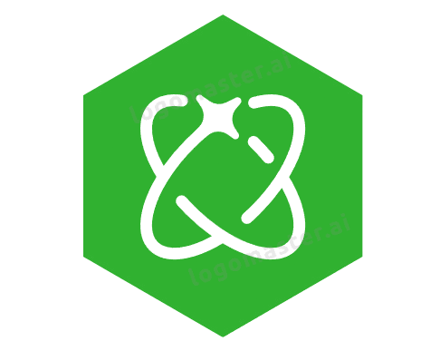

# 🤖 IntelliHire

<p align="center">
  
</p>

> Revolutionizing interview preparation with AI-powered practice sessions, real-time feedback, and personalized analytics.

---

## 🚀 Features
- **AI-Powered Mock Interviews**: Generate role-specific, technical, and behavioral questions using Gemini AI.
- **Real-Time Feedback**: Get instant, detailed feedback and scoring on your answers.
- **Tech Stack Selection**: Choose from a comprehensive list of technologies for tailored interviews.
- **Progress Tracking**: View your interview history, scores, and feedback.
- **Secure Authentication**: Sign up, log in, and manage sessions securely with Firebase Auth.
- **Modern UI/UX**: Responsive, animated, and accessible design with Tailwind CSS.

---

## 🛠️ Tech Stack

| Frontend         | Backend/API         | Auth & DB      | AI/ML         |
|-----------------|---------------------|---------------|---------------|
|  |  |  |  |
|  |  |  |  |
|  | | | |

---

## 🖥️ Frontend
- Built with **Next.js App Router** and **React**
- Modern, responsive UI with **Tailwind CSS**
- Animations and transitions for a smooth user experience
- Custom components for modals, cards, buttons, and more

## 🔒 Authentication
- **Firebase Authentication** for secure sign up, login, and session management
- Context-based auth state with React Context API
- Protected routes for dashboard and interview pages

## 🧠 Backend & AI
- **Next.js API routes** for serverless backend logic
- **Gemini API** for AI-generated questions and feedback
- **Firestore** for storing user data, interviews, answers, and feedback

## 🎤 Speech Recognition
- **react-hook-speech-to-text** for voice-based answers in interviews

---

## ⚡ Getting Started

1. **Clone the repo:**
   ```bash
   git clone https://github.com/your-username/IntelliHire.git
   cd IntelliHire
   cd IntelliHire
   ```
2. **Install dependencies:**
   ```bash
   npm install
   ```
3. **Set up environment variables:**
   - Create a `.env.local` file in the root with your Firebase and Gemini API keys.
4. **Run the development server:**
   ```bash
   npm run dev
   ```
5. **Open your browser:**
   - Visit [http://localhost:3000](http://localhost:3000)

---

## ☁️ Deployment
- **Vercel** is recommended for seamless Next.js deployment.
- Push your code to GitHub and connect your repo on [vercel.com](https://vercel.com/).
- Set environment variables in the Vercel dashboard.

---

## 📂 Project Structure
```
IntelliHire/
  ├─ public/           # Static assets (logos, images)
  ├─ src/
  │   ├─ app/          # Pages, API routes, layouts
  │   ├─ components/   # Reusable UI components
  │   ├─ contexts/     # Auth context
  │   └─ lib/          # Firebase, authService, etc.
  ├─ package.json
  ├─ tsconfig.json
  ├─ next.config.ts
  └─ ...
```

---

## 🤝 Contributing
Pull requests are welcome! For major changes, please open an issue first to discuss what you would like to change.

---

## 📧 Contact
- [GitHub](https://github.com/chit-21)
- [Email](mailto:schitranshu040@gmail.com)

---

> © 2025 IntelliHire. All rights reserved.
